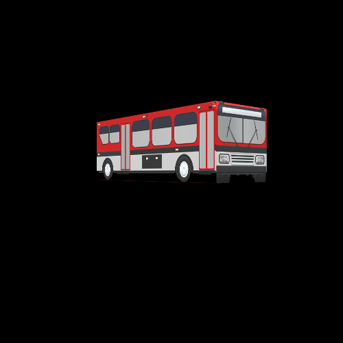
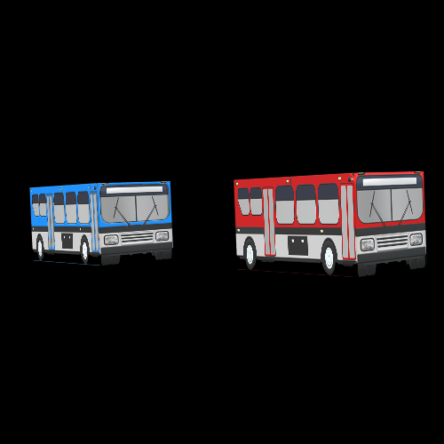
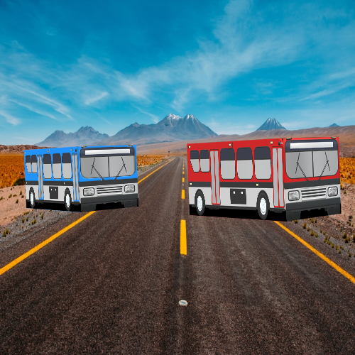

<h3>Project Name:</h3>3D Bus (Computer Graphics Lab Project).
<figure>
  
  <figcaption>Fig. - Demo Pic1.</figcaption>
</figure> 
<figure>
  
  <figcaption>Fig. - Demo Pic2.</figcaption>
</figure> 
<figure>
  
  <figcaption>Fig. - Demo Pic3.</figcaption>
</figure>

This was our last semester (4.2) "Computer Graphics Lab Project". Which we have made using JavaScript, WebGL Shader Language.

<h4>Group Project Members :</h4>
<ul style="list-style-type:square">
<li>Sagor Ahamed</li>

<li>Nabil Ahmed</li>

<li>Shanjoy Paul Shuvo</li>
</ul>

<h2>Demo Video</h2>
<h5>Link: Coming soon...</h5>
<h3>website: appsdevsa.me</h3>
